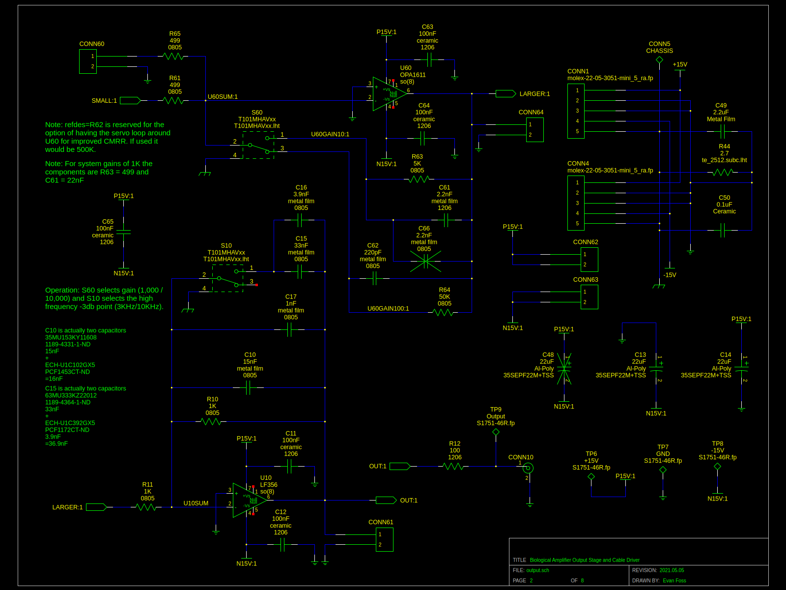

# EEF_BioAmp

This project is a family of differential input amplifiers with single ended outputs for use in electrophysiology. 
They are all *not* rated for use on humans. Let me repeat do not connect this to a person. If you do I am not responsible.

This is a fork of my original work here: https://github.com/EPL-Engineering/epl_bioamp

There are a few versions

EEF BioAmp "Fancy" - (master branch)

EEF BioAmp "Cheap" - (cheap branch)

### EEF BioAmp "Fancy"
The "Fancy" version has every bell and whistle we reasonably expect a user to need for doing ABR, DP, and EKG. Often these users have multiple dedicated amplifiers and prefer to use more involved filtering so that EKG signals can be seperated from ABR and etc for example.
The feature set I have given it so far includes.
* Twinaxial BNC Input
* Coaxial BNC Output
* Gain of 1K/10K or Gain of 10K/100K
* LPF 3KHz/10KHz
* HPF 300Hz 
* Optional the HPF can be 300Hz/10Hz
* Optional Power Line Frequency Rejection (currently 60Hz but I may do 50Hz in the future)
* Optional EPL Subrack Power
* Optional Battery Power

Please Note: The HPF option and Power Line Rejection option are mutually exclusive because of front panel constraints. Likewise the EPL Subrack Power and Battery Power are mutually exclusive because of rear panel space constraints. 

### EEF BioAmp "Cheap"

<this version is not maintaned currently>

The "Cheap" verion is designed to be pure minimalism. The idea was to have a lower cost version of the fancy that is just for ABR, DP, and EKG measurements. It's meant for our simple dedicated chambers where users exclusively do ABRs all day long with a single BioAmp and never adjust settings. The following is it's configuration.
* Twinaxial BNC Input
* Coaxial BNC Output
* Gain of 10K
* LPF 3KHz
* HPF 300Hz
* EPL Subrack Power
* Optional Power Line Frequency Rejection (currently just 60Hz but again I might add 50Hz later)

Please Note: The Power Line Frequency Rejection in some units is not user adjustable.

### EEF BioAmp "Breakout Pod"

This is shared between the "Cheap" and "Fancy" versions. Like both of them it is not for use on humans. 
It's features include the following.
* Twinaxial BNC Output
* 3 x 5 Way Binding Post Input
* 3 x 1.5mm Male Input (DIN 42802-1 Compatible Connectors)
* Holes on the sides for Mounting to Tables and etc.

The mounting holes are more important than they might sound. In a lot of our booths the EPL Subrack the EPL BioAmp sits in is on a shelf while the subject of the testing is on a sliding optical breadboard.

# Development

### Toolchain

The development toolchain was as follows:

|Tool Name             | License        | Function
|:---------------      | :------------- | :-----------------
|<a href="https://octave.org/">Octave</a>                                                    | Open Source       | Scientific Programming Language used for calculations
|<a href="https://github.com/lepton-eda/lepton-eda">lepton-eda</a>                           | Open Source       | EDA (Electronic Design Automation) suite lepton-eda a fork of gEDA
|<a href="http://repo.hu/projects/pcb-rnd/">pcb-rnd</a>                                      | Open Source       | CAD (Computer Aided Design) tool for PCB (Printed Circuit Board) layout gEDA/PCB
|<a href="https://gerbv.github.io/">gerbv</a>                                                | Open Source       | Gerber viewer
|<a href="https://www.gnu.org/software/make/">GNU/Make</a>                                   | Open Source       | Toolchain automation
|<a href="https://www.frontpanelexpress.com/front-panel-designer">Front Panel Designer</a>   | Free as in Beer   | Front Panels Express Software

The toolchain automation uses the following commands:

|Command               | Implimented | Operation
|:---------------      | :------------- | :-----------------
|make all               | Yes           | edits Makefile
|make change            | Yes           | edits all projects schematics
|make simulation        | No            | runs spice simulation
|make graph             | Yes           | opens spice simulation graph(s)
|make mainmath          | Yes           | run the numbers for the filter values
|make notchmath         | Yes           | run the numbers for the notch filter option values
|make editmainmath      | Yes           | edit the code for the filter
|make editnotchmath     | Yes           | edit the code for the notch filter
|make pcb               | Yes           | edits bioamp main board pcb
|make pcb2              | Yes           | edits notchfilter option pcb 
|make pcb3              | Yes           | edits highpass filter option pcb
|make gerbv             | Yes           | opens gerber viewer of bioamp main pcb
|make gerbv2            | Yes           | opens gerber viewer of notchfilter pcb
|make gerbv3            | Yes           | opens gerber viewer of highpass filter option pcb

### Design

The diagram in Sch0 shows the overall design concept for the fancy version of the BioAmp. 

|
|:---------------
|Sch0: Block Diagram

The mainboard of the BioAmp is made up of the schematics Sch1 & Sch2.

|
|:---------------
|Sch1: BioAmp Input Stage

|
|:---------------
|Sch2: BioAmp Output Stage

The use of the OPA1611 here is excessive considering it's performance characteristics but please see the note in "Supply Chain Issues".

|
|:---------------
|Sch3: Notch filter option

|
|:---------------
|Sch4: Highpass filter lower frequency option

|
|:---------------
|Sch5: Twinaxial coax flips documented

|
|:---------------
|Sch6: Rack based power option

|
|:---------------
|Sch7: Battery based power option

### Packaging

The BioAmp was designed with a few packaging options in mind. The image at the top of the README is of the front panel for a subrack module but it was also planned to be included in a standard 19" equipment/"server" rack package U1 size enclosure.

### Manufacturing

#### Reflow Soldering

#### Supply Chain Issues

The Input stage IC AD8221 was selected before the COVID-19 pandemic and tarif issues made the supply chain for it an issue for me. The higher quality bin of the part (lower input offset rating) has at times been hard to keep instock. Likewise the capacitors used for limiting bandwidth in the stages of Sch2 are also an issue but I resolved that by adding pads for other packages in parallel.

The performance of the device in it's first prototypes (late 2020/early 2021) and the later itterations have drifted a bit. I believe this maybe do to variations in the process control of some parts. This is why the 10KHz LPF (Low Pass Filter) option is now marked as "More". I don't like it but as this feature is almost never used by 90% of users it for more than debugging test chamber noise restoring this to a known 10KHz is not a priority.

The OPA1611 was used because it was thought at the time that it would be used in later itterations of the MicAmp and that consolidation of the parts lists would help make stocking parts easier. In reality the testing of that which was concurrent with the testing of this project showed that it was a bad idea but the part is stocked now. It would have been nice if TI had not ceased production of the LME49710 so both designs could have used that part. *grumbles*

### Validation

Validation was done by me at home with a homemade attenuator and my HP35665A and then repeated independently by Ishmael S. W. at EPL using the shop PXI and it's PXI4461 DAQ card before the BioAmp was released to the users. The first 3 or 4 users were also told to repeate the tests of frequency reponse and gain and found it proper for use in ABR (auditory brainstem response) measurement. For every unit I have made since these tests have been repeated with the HP35665A and cross checked against the original results for consistancy. Later it was suspected by me that the 10KHz option might infact be landing lower than 10KHz and so the feature was depreciated to "More" on the control panel. I bought a brand new Keysight U1733P and tested all the capacitors etc in one unit but could not find a suitable drift in component value to explain it. I had thought the soldering process revisions might be causing values to drift. More on this in the heading "Future".

### Testing

The use of an attenuator is required with the HP35665A as the input voltage range is so small all direct output settings from the DSA would be too large. The attenuator's issues could actually be the cause of the LPF 10Hz issue.

Of the dozen or so units I made only a few were notably out of spec to the point where the capacitors (often tolleranced at 2% or better) needed to be swapped to meet requirements. This most commonly happened in the 60Hz notch filter where the parts exact rating doesn't matter as much as their matching which is harder to assure without an unreasonably high BOM price.

### Changelog

## Post EPL fork

2025.03.07 - Improved README.md with images of the schematics and some initial added text

2025.03.08 - Rewritten notes into proper matlab/octave code for the BioAmp filter components

### Future

* Migration off the old gsch2pcb-rnd script which is depreciated in modern releases of pcb-rnd
* Spice Simulation of the design complete with an estimated source model.
* Refining the 10KHz mode or settling the uncertanty would be nice. 
* A more refined attenuator for testing without a PXI.

