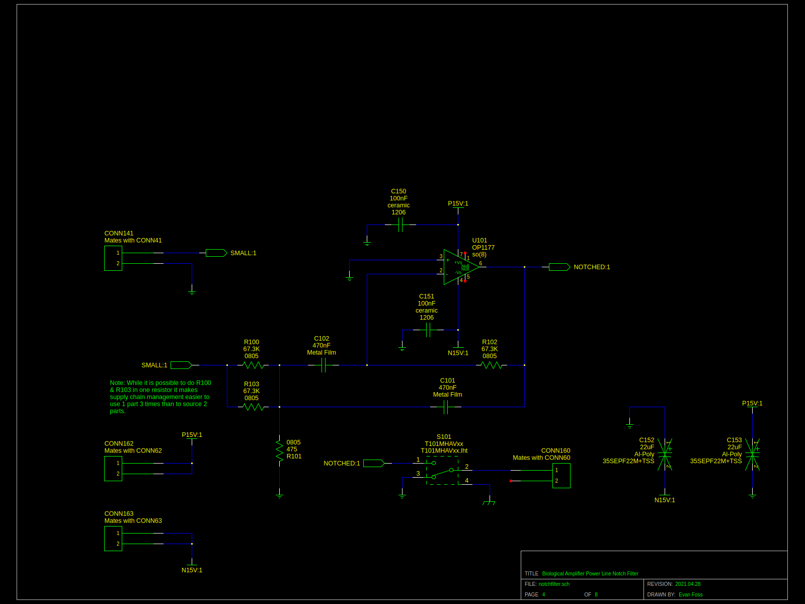

# EEF_BioAmp

This project is a family of differential input amplifiers with single ended outputs for use in electrophysiology. 
They are all *not* rated for use on humans. Let me repeat do not connect this to a person. If you do I am not responsible.

This is a fork of my original work here: https://github.com/EPL-Engineering/epl_bioamp

There are a few versions

EEF BioAmp "Fancy" - (master branch)

EEF BioAmp "Cheap" - (cheap branch)

### EEF BioAmp "Fancy"
The "Fancy" version has every bell and whistle we reasonably expect a user to need for doing ABR, DP, and EKG. Often these users have multiple dedicated amplifiers and prefer to use more involved filtering so that EKG signals can be seperated from ABR and etc for example.
The feature set I have given it so far includes.
* Twinaxial BNC Input
* Coaxial BNC Output
* Gain of 1K/10K or Gain of 10K/100K
* LPF 3KHz/10KHz
* HPF 300Hz 
* Optional the HPF can be 300Hz/10Hz
* Optional Power Line Frequency Rejection (currently 60Hz but I may do 50Hz in the future)
* Optional EPL Subrack Power
* Optional Battery Power

Please Note: The HPF option and Power Line Rejection option are mutually exclusive because of front panel constraints. Likewise the EPL Subrack Power and Battery Power are mutually exclusive because of rear panel space constraints. 

|
|:---------------
|Pic1: A picture of a BioAmp front panel upclose enclosed in a subrack module.

|
|:---------------
|Pic2: A picture of inside of an assembled BioAmp.

### EEF BioAmp "Cheap"

<this version is not maintaned currently>

The "Cheap" verion is designed to be pure minimalism. The idea was to have a lower cost version of the fancy that is just for ABR, DP, and EKG measurements. It's meant for our simple dedicated chambers where users exclusively do ABRs all day long with a single BioAmp and never adjust settings. The following is it's configuration.
* Twinaxial BNC Input
* Coaxial BNC Output
* Gain of 10K
* LPF 3KHz
* HPF 300Hz
* EPL Subrack Power
* Optional Power Line Frequency Rejection (currently just 60Hz but again I might add 50Hz later)

Please Note: The Power Line Frequency Rejection in some units is not user adjustable.

### EEF BioAmp "Breakout Pod"

This is shared between the "Cheap" and "Fancy" versions. Like both of them it is not for use on humans. 
It's features include the following.
* Twinaxial BNC Output
* 3 x 5 Way Binding Post Input
* 3 x 1.5mm Male Input (DIN 42802-1 Compatible Connectors)
* Holes on the sides for Mounting to Tables and etc.

The mounting holes are more important than they might sound. In a lot of our booths the EPL Subrack the EPL BioAmp sits in is on a shelf while the subject of the testing is on a sliding optical breadboard.

|
|:---------------
|Pic2: A picture of 5 breakout pods.

# Development

### Toolchain

The development toolchain was as follows:

|Tool Name             | License        | Function
|:---------------      | :------------- | :-----------------
|<a href="https://octave.org/">Octave</a>                                                    | Open Source       | Scientific Programming Language used for calculations
|<a href="https://github.com/lepton-eda/lepton-eda">lepton-eda</a>                           | Open Source       | EDA (Electronic Design Automation) suite lepton-eda a fork of gEDA
|<a href="http://repo.hu/projects/pcb-rnd/">pcb-rnd</a>                                      | Open Source       | CAD (Computer Aided Design) tool for PCB (Printed Circuit Board) layout gEDA/PCB
|<a href="https://gerbv.github.io/">gerbv</a>                                                | Open Source       | Gerber viewer
|<a href="https://www.gnu.org/software/make/">GNU/Make</a>                                   | Open Source       | Toolchain automation
|<a href="https://www.frontpanelexpress.com/front-panel-designer">Front Panel Designer</a>   | Free as in Beer   | Front Panels Express Software

The toolchain automation uses the following commands:

|Command               | Implimented | Operation
|:---------------      | :------------- | :-----------------
|make all               | Yes           | edits Makefile
|make change            | Yes           | edits all projects schematics
|make simulation        | No            | runs spice simulation
|make graph             | Yes           | opens spice simulation graph(s)
|make mainmath          | Yes           | run the numbers for the filter values
|make notchmath         | Yes           | run the numbers for the notch filter option values
|make editmainmath      | Yes           | edit the code for the filter
|make editnotchmath     | Yes           | edit the code for the notch filter
|make pcb               | Yes           | edits bioamp main board pcb
|make pcb2              | Yes           | edits notchfilter option pcb 
|make pcb3              | Yes           | edits highpass filter option pcb
|make gerbv             | Yes           | opens gerber viewer of bioamp main pcb
|make gerbv2            | Yes           | opens gerber viewer of notchfilter pcb
|make gerbv3            | Yes           | opens gerber viewer of highpass filter option pcb

### Design

## Circuit Design

The diagram in Sch0 shows the overall design concept for the fancy version of the BioAmp. 

|
|:---------------
|Sch0: Block Diagram

The mainboard of the BioAmp is made up of the schematics Sch1 & Sch2. The optional Notch Filter board is just Sch3, and the optional highpass filter option is Sch4.

|
|:---------------
|Sch1: BioAmp Input Stage

Sch1 shows the input filter composed of L40, L41, C40, C41, R42, and R43.

Sch1 also includes the insturmentation amplifier is U40, and it's gain limits it's frequency response. The gain for this stage is set by R45 + R41. It has the usual capacitors sprinkled around it for power supply decoupling.

U40 was selected for it's ability to operate at high gain with relatively low noise, and a level of input offset that could be overcome with an integrator. 

The inverting integrator which acts as a low pass filter is built around U20. R20 and C20 set the time constant for the integration. R21 and the jumper over it are for adjusting this lower limit if the highpass filter adjustment option is installed. 

U20 was selected for it's lower input bias current, low input offset voltage, and of course to drive a capacitive load.

|
|:---------------
|Sch2: BioAmp Output Stage

Sch2 starts with the inverting amplifier that adds the rest of the gain required. It has 2 inputs. The 1st input is from the input stage on Sch1 and the 2nd is for the notch filter option. S20 selects the feedback RC pair (R63 & C61) or (R64 & C62). 

The use of the OPA1611 here is excessive considering it's performance characteristics but please see the note in "Supply Chain Issues". However it is very low noise in this application. 

In Sch2 we also have the final output stage which is built around U10. It is setup to just invert the signal at unit gain. The switch S10 adds added capacitence across the feedback resistor R10. Obviously R10 and R11 should match each other for this to work. C10+C17 put a limit on the frequency response. C16+C17 add more capacitence to lower the frequency response even more.

Once more to control noise the chassis ground is connected to the exterior of the switches S20 and S10 so that it can connect through them to the chassis.

|
|:---------------
|Sch3: Notch filter option

The notch filter shown in Sch3 is built around U101. It works as an inverting unity gain filter. That way the inverted signal can be added back into the main device at cancel out the offending frequency. Normally this would cause phase issues but the frequency in question is 60Hz (or with changes 50Hz).

U101 was selected using the same criteria as U20 on Sch1 as a result the same part was selected. I should really say I picked this topology so I could use the same opamp and the same value for C101 and C102 as I did in C20. The catch is that C101 and C102 require a level of tollerance that C20 does not because the notch filter's performance is tied to the matching of these parts.

|
|:---------------
|Sch4: Highpass filter lower frequency option

Sch4 just optionally adds resistance in the integrator in Sch1 slowing down it's integration rate and lowering the input stage's highpass filter to 10Hz.

|
|:---------------
|Sch5: Twinaxial coax flips documented

Sch5 just helps you understand the polarity of the signal as it goes through the twinaxial wiring.

|
|:---------------
|Sch6: Rack based power option

Sch6 really is what it says.

|
|:---------------
|Sch7: Battery based power option

Sch7 like Sch6 is exactly what it says.

## Printed Circuit Board Layout

One more thing about U40. Although it has yet to happen I believe this is the part most likely to be toasted by static discharge as it is the most directly connected to the user touchable connections. This is why it's on a small SOIC to DIP adapter. It is a method of reducing downtime from repairs. 

The layout was obviously designed to have the feedback paths as short as was reasonably possible. The decoupling capacitors were also kept close to the pins of the opamps they were meant to be near. Some effort was put into making sure the input side of the insturmentation amplifier was kept away from the rest of the design to avoid coupling anything over.

I sprinkled in a liberal number of test points so that repairs and debuging would be easier. 

The layout was drawn to be inside this size onvelope based on the packaging plan I had. For more on that see "Packaging".

### Packaging

The BioAmp was designed with a few packaging options in mind. The image at the top of the README is of the front panel for a subrack module but it was also planned to be included in a standard 19" equipment/"server" rack package U1 size enclosure. The idea was to package it with the other hardware commonly used in the chamber for doing ABR (Auditory Brainstem Response) testing.

|
|:---------------
|Pic3: Front panel of an integrated device with a <a href="https://github.com/evanfoss/eef_micamp">Mic Amp</a>, <a href="https://github.com/evanfoss/eef_equalizer">Equalizer</a> and BioAmp all in a U1 enclosure.

That said I prefer the subrack module packaging shown at the opening of the readme in Pic1 because of the other modules that fit neetly in the subrack.

|
|:---------------
|Pic4: An array of just some of the many subrack modules that could be used in parallel to the BioAmp.

Outside of EPL of course this level of flexibility is in low demand.

The other big demand is of course battery powered operation. Now I frown on it because of the environmental footprint of batteries but there is a rear panel design that is included in the project files. Some thought went into the selection of the battery holder to make ease of changing the batteries without opening the cover easier. I find those little vinyl enclosed snap on 9V connectors unpleasant. The holder I selected costs a lot more but it works very well, the covers are hard to loose, and in most cases they make it impossible to put the batteries in backwards. 

The power button assembly was picked both because the on/off state was clearly visible without power but also because some experiments require low to zero illumination so power indicator lights are frowned appoon. I had a project with optogenetics and a blue power indicator in a commericially made device was causing trouble.

The breakout pod (Pic2) was designed in because many users require the chamber table to be at a distance from the equipment rack or for ergonomic reasons they need a chamber to have a pull out tray. So connecting the electrodes to the BioAmp front panel directly was not advisable.

### Manufacturing

Initial prototypes were made with hand soldering under a microscope. However I prefer to build these in batches which makes using solder paste nessisary. 

#### Reflow Soldering

With the switch to reflow soldering I had to switch to solder paste. Because solder paste has to be washable in this case the flux was going to dry out and I worried about the fine metal balls in the suspension were going to become a safety concern. This required the change to lead free solder to reduce exposure risk.

This is my current assembly process:

0. Verify that all parts are on hand including front panel
1. Stencil on solder paste
2. Apply SMT components
3. Warm the PCBA on a hot plate
4. Reflow PCBA
5. Ramp PCBA temperature down
6. Solder all through hole components except the switches and connectors
7. Insert switches and connectors and fasten them to the front panel (finger tight)
8. Solder switches and connectors
9. Detach front panel from PCBA
10. Wash PCBA and front panel seperatly
11. Check PCBA under microscope and record assembly with pictures
12. Assemble PCBA into chassis and test

|
|:---------------
|Pic5: Populated BioAmp main circuit board and notch filter option board on the right.

#### Supply Chain Issues

The Input stage IC AD8221 was selected before the COVID-19 pandemic and tarif issues made the supply chain for it an issue for me. The higher quality bin of the part (lower input offset rating) has at times been hard to keep instock. Likewise the capacitors used for limiting bandwidth in the stages of Sch2 are also an issue but I resolved that by adding pads for other packages in parallel.

The performance of the device in it's first prototypes (late 2020/early 2021) and the later itterations have drifted a bit. I believe this maybe do to variations in the process control of some parts. This is why the 10KHz LPF (Low Pass Filter) option is now marked as "More". I don't like it but as this feature is almost never used by 90% of users it for more than debugging test chamber noise restoring this to a known 10KHz is not a priority.

The OPA1611 was used because it was thought at the time that it would be used in later itterations of the MicAmp and that consolidation of the parts lists would help make stocking parts easier. In reality the testing of that which was concurrent with the testing of this project showed that it was a bad idea but the part is stocked now. It would have been nice if TI had not ceased production of the LME49710 so both designs could have used that part. *grumbles*

The notch filter requires on obscure part 67.3K Ohm resistors ideally in 1% or better tollerance. I resolved this issue by buying in large quantity.

To simplify the front panel design and supply chain issues I used the same model switch for everything.

The front panel twinaxial connector that is PCB mount and right angle is no longer manufactured. However it is still commonly available on the surplus market. The non-PCB mount version is also still common so you can buy those and solder wires to the PCB.

### Validation

Validation was done by me at home with a homemade attenuator and my HP35665A and then repeated independently by Ishmael S. W. at EPL using the shop PXI and it's PXI4461 DAQ card before the BioAmp was released to the users. The first 3 or 4 users were also told to repeate the tests of frequency reponse and gain and found it proper for use in ABR (auditory brainstem response) measurement. For every unit I have made since these tests have been repeated with the HP35665A and cross checked against the original results for consistancy. Later it was suspected by me that the 10KHz option might infact be landing lower than 10KHz and so the feature was depreciated to "More" on the control panel. I bought a brand new Keysight U1733P and tested all the capacitors etc in one unit but could not find a suitable drift in component value to explain it. I had thought the soldering process revisions might be causing values to drift. More on this in the heading "Future".

### Testing

The use of an attenuator is required with the HP35665A as the input voltage range is so small all direct output settings from the DSA (Dynamic Signal Analyzer) would be too large. The attenuator's issues could actually be the cause of the LPF 10Hz issue.

Of the dozen or so units I made only a few were notably out of spec to the point where the capacitors (often tolleranced at 2% or better) needed to be swapped to meet requirements. This most commonly happened in the 60Hz notch filter where the parts exact rating doesn't matter as much as their matching which is harder to assure without an unreasonably high BOM price.

## Changelog

### Post EPL fork

2025.03.07 - Improved README.md with images of the schematics and some initial added text

2025.03.08 - Rewritten notes into proper matlab/octave code for the BioAmp filter components

## Future

* Migration off the old gsch2pcb-rnd script which is depreciated in modern releases of pcb-rnd
* Spice Simulation of the design complete with an estimated source model.
* Refining the 10KHz mode or settling the uncertanty would be nice. 
* A more refined attenuator for testing without a PXI.

